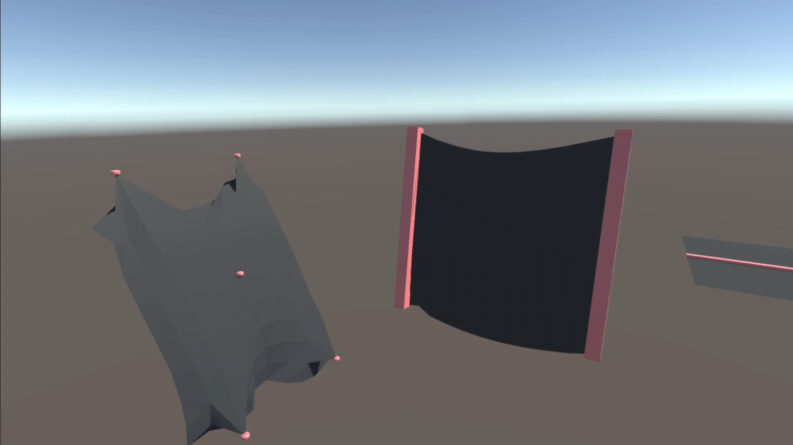
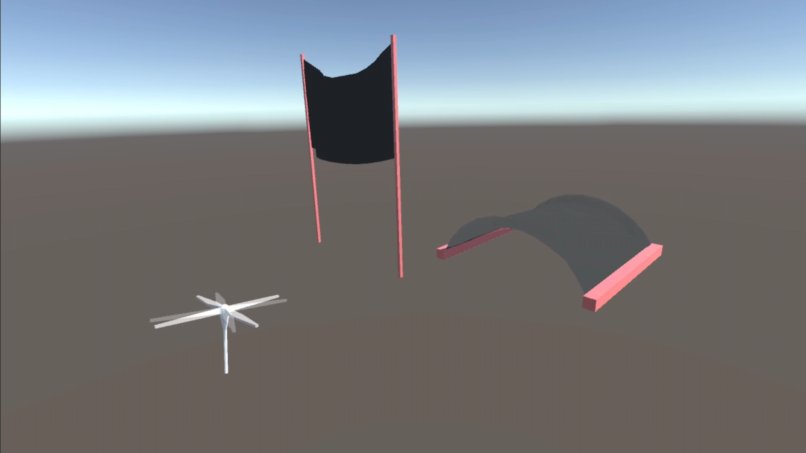
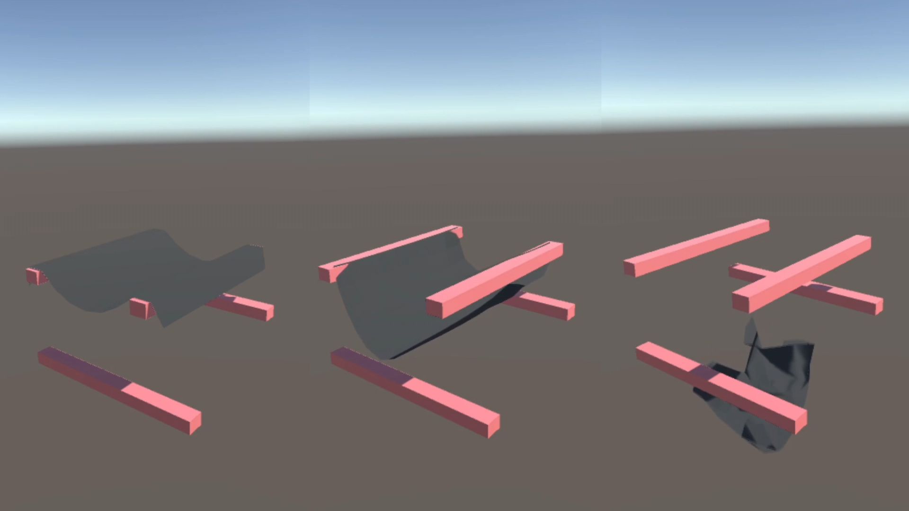
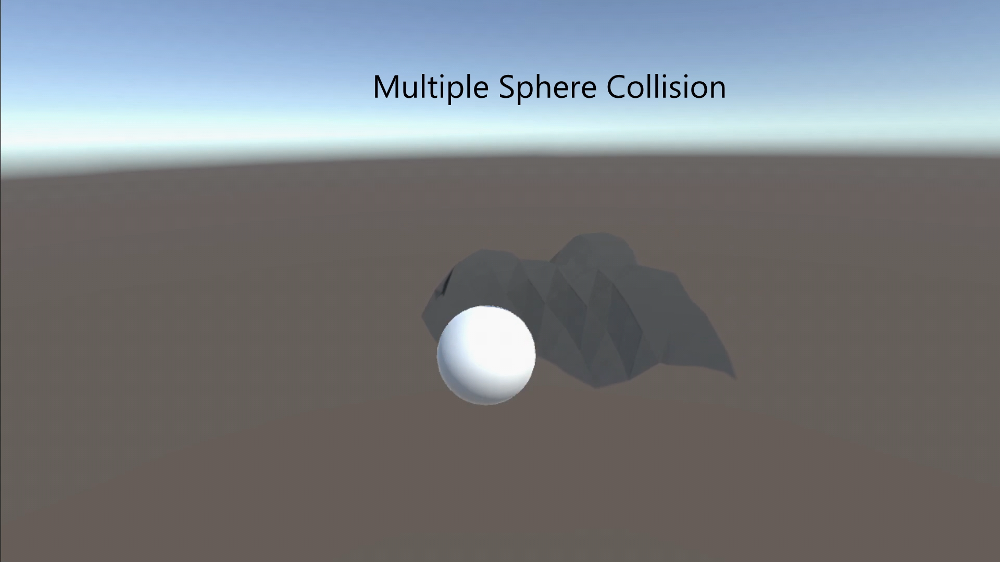
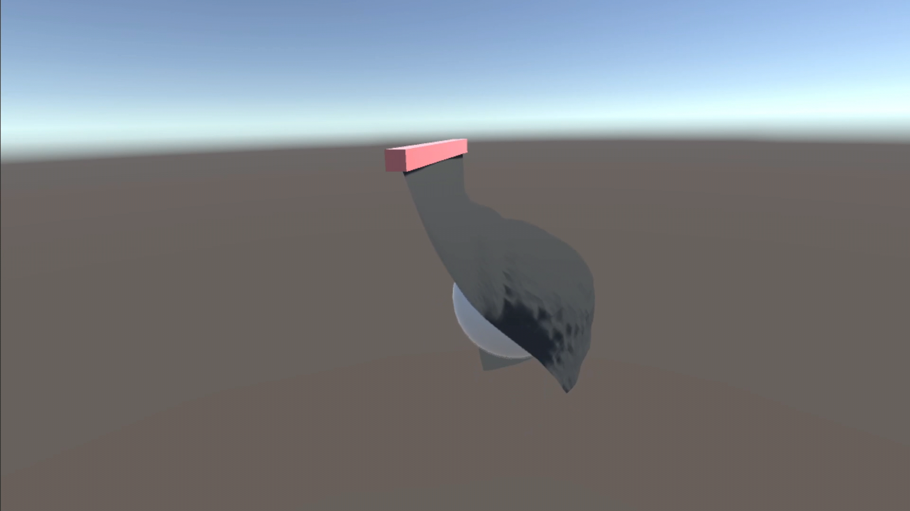

<h1 align="center">Custom Cloth Physics [Unity 2020.3.21f1]</h1>

Video here: https://www.youtube.com/watch?v=rBAr3ZezT6M

<h2>What is this about?</h2>

This project is about implementing cloth behaviour. Takes a mesh as base, gives the nodes and strings physic properties and further computation is done.

<h2>What behaviours are implemented?</h2>
<ul>
  <li>Mesh collisions to cuboids and spheres. Different modes have been explored, comparative can be seen in the video.</li>
  <li>Wind computation.</li>
  <li>Attributes to adjust as desired. For example: gravity, stiffness, substeps, etcetera.</li>
  <li>Fixers that can be moved around.</li>
  <li>Find out more in the video :D</li>
</ul>

  
  
  
  
  

